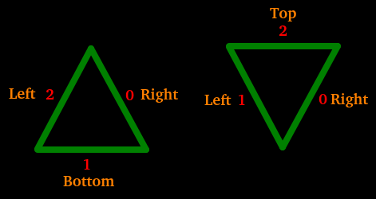
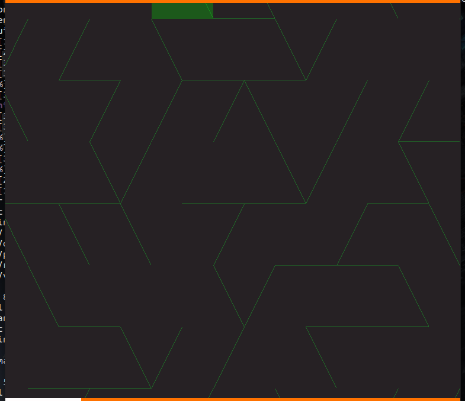
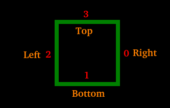
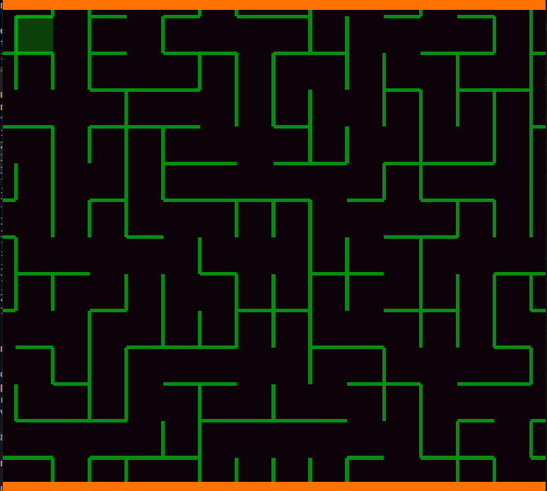
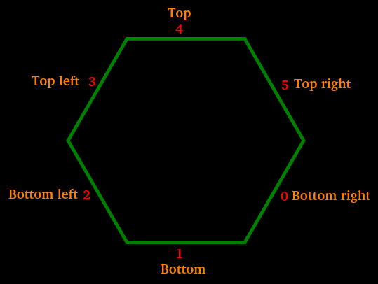
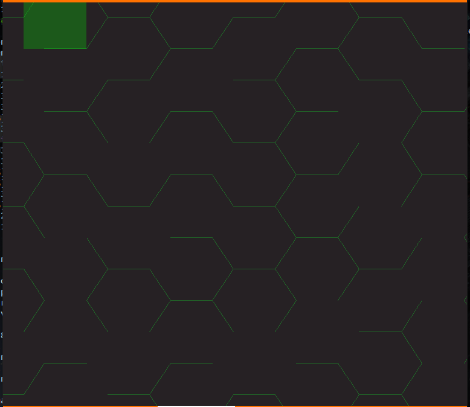
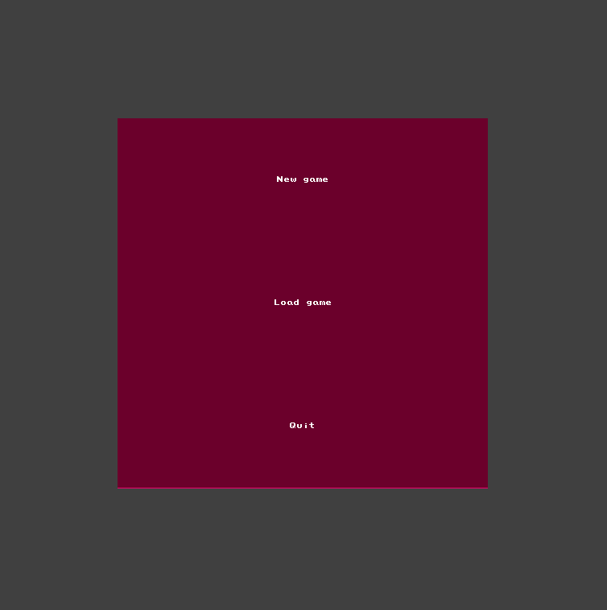
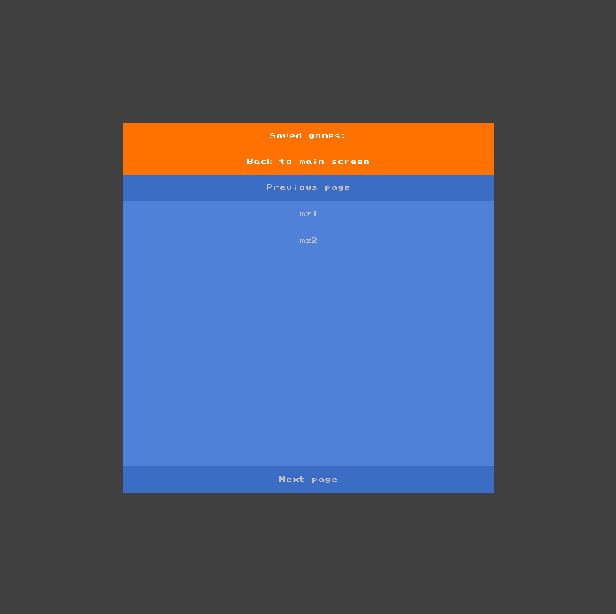
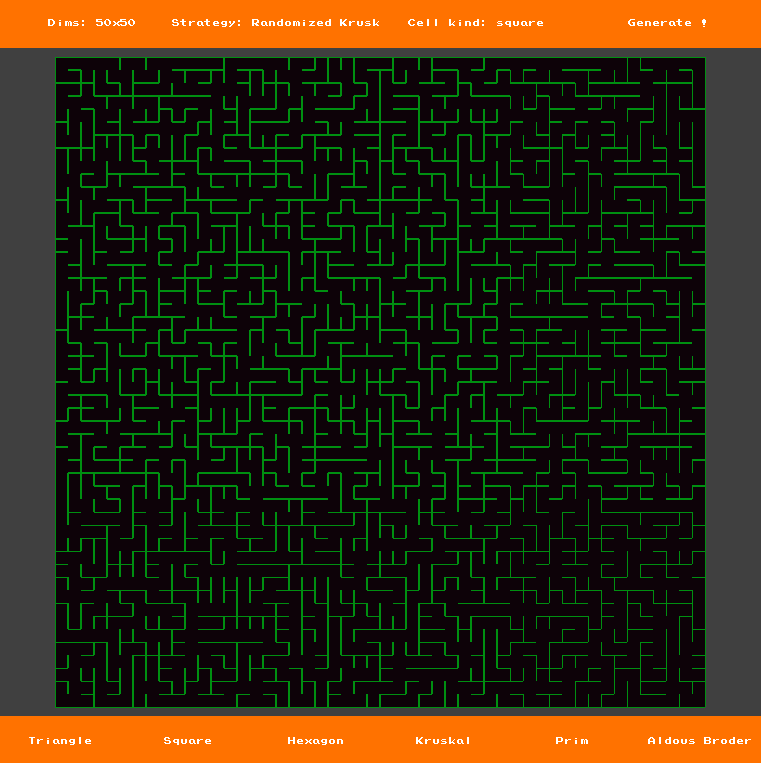

# maze

Toy project to implement maze generation with different shapes.

# Installation

- Clone the repo: `git clone git@github.com:Knoblauchpilze/maze.git`.
- Clone dependencies:
    * [core_utils](https://github.com/Knoblauchpilze/core_utils)
    * [maths_utils](https://github.com/Knoblauchpilze/maths_utils)
- Go to the project's directory `cd ~/path/to/the/repo`.
- Compile: `make run`.

# Generate principle

This application aims at providing an environment to explore and generate mazes. Nothing can really be done with the maze besides generating it, saving it and exploring it.

We allow the creation of files which describe the mazes to be used in other application. Also, note that we provide various options to handle the generation of different kind of mazes (both in terms of structure and shape).

# What is a maze ?

A maze is a structure where cells with a various number of exits are connected to one another so that there's a single path from an entrance to an exit.

## Cell kind and shape

A maze is defined by a way to generate it, but also (and maybe more importantly) by the shape of the cells. By shape we mean the shape of individual elements in the maze.

In the application we support three kinds of cells:
* Triangular cells
* Square cells
* Hexagonal cells

These shapes are selected because they allow a regular tiling of the plane (see [here](https://en.wikipedia.org/wiki/List_of_regular_polytopes_and_compounds#Euclidean_tilings)).

**IMPORTANTE NOTE:** Doors for a cell are always laid out in a clockwise way, starting from what is the most similar to what would be a right-facing door.

### General consideration

In order to create the maze, we have to lay out the cells in a way where all of them are connected. Depending on the shape of the cells, it can be more or less complex.

In order to allow to easily extend the concept of a maze in order to generate new ones with different tiling, we provide an interface which defines methods that are used when generating and which should, when provided, allow to extend the generation to any shape for cells:

```cpp
class Maze {
    /**
     * @brief - Whether or not this cell is inverted. This allows to
     *          handle the case where a cell (due to its number of
     *          sides) is not always in the same orientation in the
     *          maze. Typically triangle will have to be upside down
     *          once in a while to generate a triangular maze. This
     *          method determines whether the cell at the specified
     *          coordinates is inverted or not.
     *          In case the coordinate is not valid an error is raised.
     * @param x - the x coordinate of the cell.
     * @param y - the y coordinate of the cell.
     * @return - `true` if the cell is inverted.
     */
    virtual bool
    inverted(unsigned x, unsigned y) const = 0;

    /**
     * @brief - Used to generate the index of the move going in the
     *          opposite direction based on the geometry of the cells
     *          for this maze.
     * @param door - the door for which the opposite door should be
     *               returned.
     * @param inverted - Whether or not the cell to which the door
     *                   belongs is inverted (as defined in the
     *                   inverted method).
     * @return - the index of the opposite door.
     */
    virtual unsigned
    opposite(unsigned door, bool inverted) const noexcept = 0;

    /**
     * @brief - Interface method allowing to constrain an opening
     *          based on the dimensions of the cells. This is used
     *          whenever a cell is picked for the maze generation.
     * @param o - output argument describing the opening to modify.
     */
    virtual void
    prepareOpening(Opening& o) const noexcept = 0;

    /**
     * @brief - Interface method used to compute the index of the
     *          cell reached by going through the specified door
     *          for the input coordinates.
     *          The coordinates are assumed to be valid and the
     *          door *will* be valid based on the number of cells.
     * @param x - the x coordinate of the starting position.
     * @param y - the y coordinate of the starting position.
     * @param door - the door to go through.
     * @return - the index of the cell (as a linear value) that is
     *           reached when going through the door of the cell.
     */
    virtual unsigned
    idFromDoorAndCell(unsigned x, unsigned y, unsigned door) const = 0;

    /**
     * @brief - Interface method allowing to provide a human readable
     *          name for a door.
     * @param id - the index of the door in the cell.
     * @param inverted - whether the cell to which the door belongs to
     *                   is inverted.
     * @return - a string representing the name of the door.
     */
    virtual
    std::string
    doorName(unsigned id, bool inverted) const noexcept = 0;
};
```

The idea is that for one cell we have to be able to uniquely identify a few properties that can then be used during the generation.

#### inverted

As the cells need to tile the plane, we introduce a concept of inverted cell. Typically we assume that there's a canonical way to represent the shape used for a cell, and this method allows to determine whether we need to invert it for a specific coordinate in the tiling.

It is mainly useful in case the tiling is a bit complex (typically not for squares), like in the case of triangles. See the [triangular maze](#triangular-maze) section for more information.

#### opposite

One property is to determine the opposite door: this is used when opening a door (say the left door of a cell), to determine which door should be opened in the connected cell.

#### prepareOpening

Allows to prepare the cell to mark the doors that can't be opened (for various reasons, one of them because it would lead to an invalid cell, for example outside of the maze). This is used when generating the maze to only keep the doors that are valid to be considered.

#### idFromDoorAndCell

Allows to define the linear index of the cell which is reached by going through a certain door in a cell. This is used when generating the maze to open the corresponding door in the connected cell.

#### doorName

Convenience method to assign a name to the door: this is mainly useful to debug the generation of the mazes.

### Triangular maze

A triangular maze is a regular tiling of the plane with triangles. In order to connect correctly the triangles with each other, we have to resort to the `inverted` mechanism: this will basically turn some of the triangles upside down to connect them better.

The doors are named `"right"`, `"bottom"`, `"left"` and `"top"`, but not all of them are availabel in all triangles: which ones precisely are available depend on whether the triangle is inverted.



The left triangle is considered `"regular"` and the right one is `"inverted"`. The doors are slightly different but they are always laid out clockwise.

Each triangle is connected to the other in the following way:
* For regular triangles:
  * Door 0 - Door 1
  * Door 1 - Door 2
  * Door 2 - Door 0
* For inverted triangles:
  * Door 0 - Door 2
  * Door 1 - Door 0
  * Door 2 - Door 1

When generating a maze, we consider that the first cell at `(0, 0)` is an inverted triangle, and move from here. The general idea is that:
* even triangles in even rows are inverted.
* odd triangles in odd rows are inverted.

An example view of a triangular maze is as follows:



### Square maze

A square maze is probably the most intuitive type of maze. It doesn't differ that much from a triangular maze in its essence but is more easily understandable visually.

Unlike the triangular maze, it does not require inverted cells. Each cell is similar and is connected in a neat way to all the others.

The doors are named `"right"`, `"bottom"`, `"left"` and `"top"`. These doors are labeled in order from `0` to `1`. This is the representation of a canonical square:



Each square is connected to the other in the following way:
* Door 0 - Door 2
* Door 1 - Door 3
* Door 2 - Door 0
* Door 3 - Door 1

An example view of a square maze is as follows:



### Hexagonal maze

An hexagonal maze is composed of a regular tiling of hexagons. The only subtelty compared to the square case is that the hexagons require a slightly more elaborate alignment to all connect to one another.

The doors are named `"bottom right"`, `"bottom"`, `"bottom left"`, `"top left"`, `"top"` and `"top right"`. This is the representation of a canonical hexagon:



As for squares, we don't have such a thing as inverted hexagons: all of them are connected in a similar way and just need to be placed close to one another in a specific way.

Each hexagon is connected to the other in the following way:
* Door 0 - Door 3
* Door 1 - Door 4
* Door 2 - Door 5
* Door 3 - Door 0
* Door 4 - Door 1
* Door 5 - Door 2

An example view of a hexagonal maze is as follows:



## Generation

There are several ways one can generate a maze. We didn't invent anything in this application, but rather used the very good article on Wikipedia related to the generation of [mazes](https://en.wikipedia.org/wiki/Maze_generation_algorithm).

Among the possible algorithms, we chose to focus on three of them:
* Randomized Kruksal
* Randomized Prim
* Aldous-Broder

Each algorithm has its strenghts and weaknesses.

### Randomized Kruksal

Shortly described, the idea of the alrogithm is to remark that in order to obtain a connected maze, we have to connect cells in a unique path. This is achieved by assigning identifiers to `regions` (i.e. groups of cells) and then randomly trying to open doors on cells: whenever we obtain cells that belong to a different region, it means that the path defined by each cell was not connected yet and so we can merge the two regions. Otherwise, we already have a unique way to connect the two cells and so we pick another door to open.

This gives an exact value for the number of doors to open (which is equal to the number of cells) and allows to implement the algorithm quite easily.

A more comprehensive description of the algorithm can be found on [Wikipedia](https://en.wikipedia.org/wiki/Maze_generation_algorithm#Randomized_Kruskal's_algorithm).

### Randomized Prim

The idea is to start with a maze with all walls created. Then we pick a random cell and add all its walls to the processing list. Throughout the algorithm we maintain this list of walls and pick one at random. If the wall allows to transition from one visited cell to a not visited one then we open the wall. We then need to register the walls connecting the new cell and mark the new cell as visited.

We continue to attempt to visit cells as long as we have walls to explore.

A more comprehensive description of the algorithm can be found on [Wikipedia](https://en.wikipedia.org/wiki/Maze_generation_algorithm#Randomized_Prim's_algorithm).

### Randomized depth-first

This algorithm is quite simple but is biased towards long corridors. The principle is to pick a random cell and mark it as visited. Then check if any of the neighbors are not visited yet. If it's the case, add back the cell and the new neighbor to the stack of nodes to visit and open the door between the current cell and the picked neighbor.

Then repeat until there are no more cells in the stack. Over time all the neighbors of each cell will be exhausted and we will obtain a complete coverage of the maze.

A more comprehensive description of the algorithm can be found on [Wikipedia](https://en.wikipedia.org/wiki/Maze_generation_algorithm#Iterative_implementation).

# The UI

The user interface of the application is very similar to the base skeleton for a PGE app. The application opens on a general menu allowing to generate a new maze, or load an existing one, or quit the application.

## General structure

### Home menu

The home menu allows to choose what the user wants to do.



### Load maze

The save menu allows to load a previously saved maze. A list of files is shown, the user can click on `Previous page` or `Next page` if available, and also on any of the listed worlds.

When the user clicks on one of the save, the application will attempt to load the data and move to the `Game` screen. In case of failure the screen will stay on the load screen.



The list of files is fetched from a default directory which is located at `data/saves` and only files with the extension `mz` are displayed.

In case the user chooses to save a maze, a new name is generated which should not match any of the existing files. The name of the file will be similar to `"data/saves/save_ID.mz"`.

Note that the save does not include the strategy used to generate the maze so we pick one by default. It does not impact the actual visual of the maze and does not prevent it to be loaded, it will only have some relevance when the user attempts to generate a new one.

### Generate a new/Explore a maze

The main view of the application allows to explore and generate a new maze. The information available about the size of the maze is displayed along with the strategy that will be used to generate a new one if needed.



#### Generation menu


This menu displays information about the properties to use to generate a new maze. The only interactive button in the `Generate !` one on the far right: the user can click it to generate a new maze.

The dimensions of the maze are displayed (or updated in case the maze is loaded from a file), along with the strategy that is used to generate a new one (might not apply in case the maze has been loaded from a file) and the shape of the cells.

#### Main view

The central part of the application is used by an interactive display where the user can pan, zoom and generally move around the maze that is currently displayed.

The user can zoom in with the mouse wheel, and pan by holding the right mouse button.

**IMPORTANT NOTE:** that at lower zoom level, the display can be a bit weird with doors not necessarily having all the same size or disappear altogether. This is not necessarily the best way to do it but is due to the way we're displaying the doors.

Also note that the view is not responsive when the maze is being generated.

The user can save the maze that is currently displayed at any time by pressing the `S` key. Also, the user can generate a new maze by using the `G` key.

An overlay is displayed to indicate which cell the user is hovering over and adapts based on the type of the cell.

#### Configuration menu


The configuration menu allows to change the properties that will be used to generate the next maze (so when the user will hit the `Generate !` button or the `G` key). **It has no impact on the currently displayed maze**.

The user can select both the shape of the cells for the maze, and the algorithm used to generate its internal structure.

## Serialization

A maze once generated can be serialized into a file to be loaded later. The serialization process aims at saving all the important information to the file.

### Format

The format for serialized mazes is a binary file which contains information about the dimensions of the maze and the shape of cells. Then all the cells defining the maze are stored.

So the format is as follows:

```
4 bytes for the width of the maze in pixels.
4 bytes for the height of the maze in pixels.
4 bytes for the number of doors for each cell.

width * height * sides bits defining the doors for each cell.
```

Note that each cell is stored in order, starting with the cell at `(0, 0)`, then `(1, 0)` up to `(width - 1, 0)`, then `(0, 1)`, etc.

